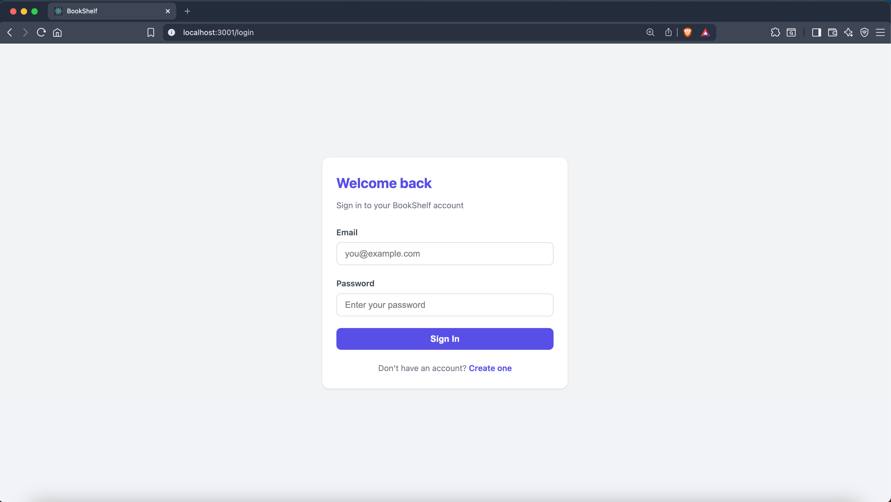
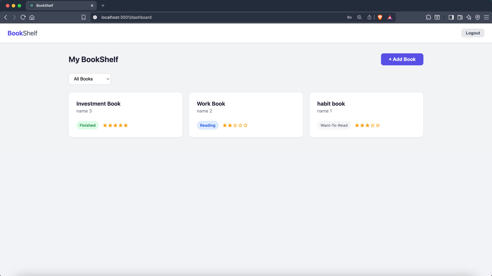
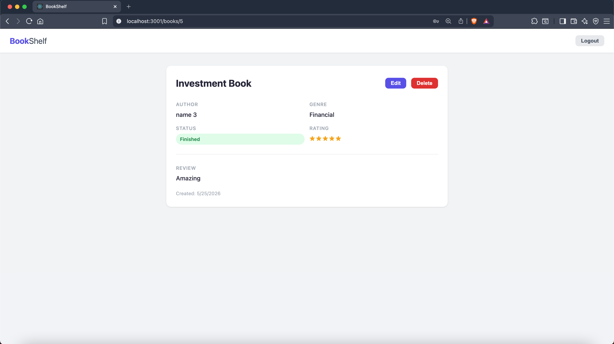
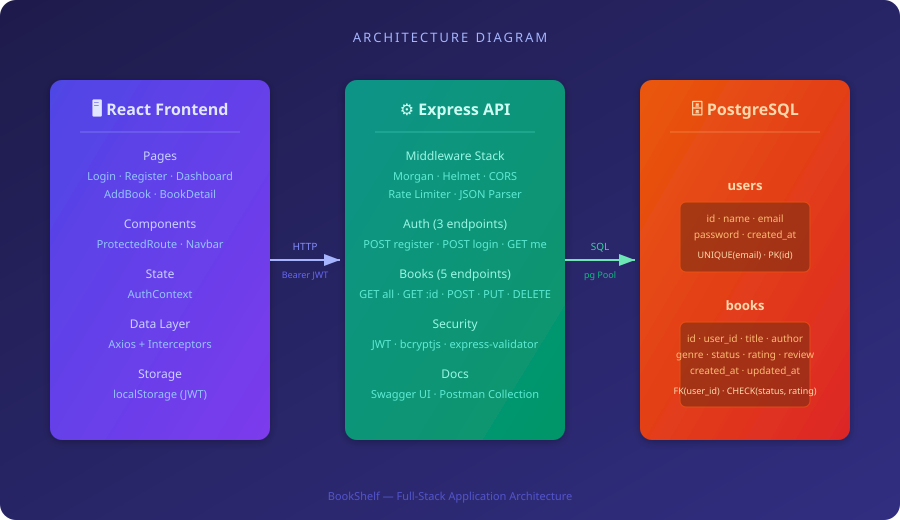
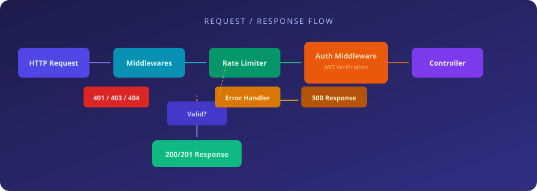
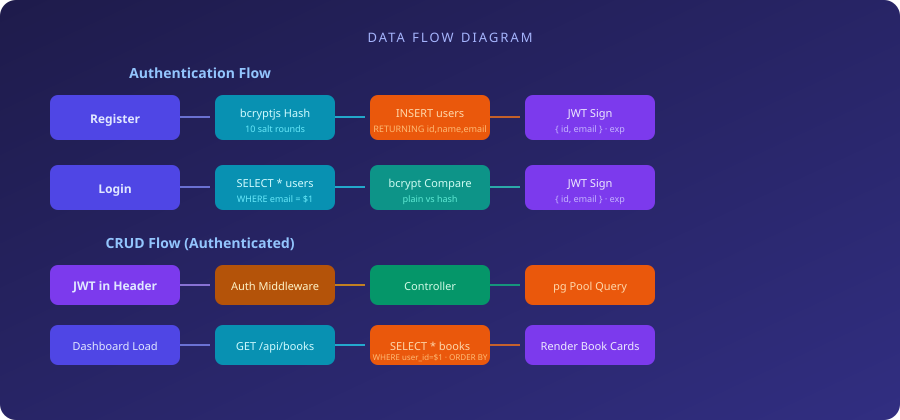

<div align="center">
  <br/>
  
  <br/>
  <br/>

  <p>
    <strong>A full-stack book collection manager</strong><br/>
    Track, rate, and organize your reading journey with a REST API and a React dashboard.
  </p>

  <p>
    
    
    
    
    
    
  </p>
</div>

---

## 📸 Screenshots

> _Replace these placeholders with actual screenshots of your running application._

<div align="center">
  <table>
    <tr>
      <td align="center"><strong>Login Page</strong></td>
      <td align="center"><strong>Dashboard</strong></td>
      <td align="center"><strong>Book Detail</strong></td>
    </tr>
    <tr>
      <td></td>
      <td></td>
      <td></td>
    </tr>
  </table>
  <br/>
  <sub><i>Place screenshot PNGs in <code>docs/images/</code> and name them <code>screenshot-login.png</code>, <code>screenshot-dashboard.png</code>, <code>screenshot-detail.png</code>.</i></sub>
</div>

---

## 🏗️ Architecture

<div align="center">
  
</div>

### Request Flow

<div align="center">
  
</div>

### Data Flow

<div align="center">
  
</div>

---

## ☁️ AWS Infrastructure

| Service | Detail |
|---|---|
| **EC2** — Elastic Compute Cloud | Virtual server running the Node.js API, `t2.micro`, Ubuntu 22.04 |
| **RDS** — Relational Database Service | Managed PostgreSQL, `db.t3.micro`, database: `bookshelf` |
| **VPC** — Virtual Private Cloud | Auto-created private network connecting EC2 ↔ RDS |
| **Security Groups** | Firewall rules: ports **22** (SSH), **80** (HTTP), **3000** (Node.js) open |
| **Nginx** | Reverse proxy on EC2 in front of the Node.js app |

---

## 🧱 Project Structure

```
bookshelf-api/
│
├── src/                          # Express API server
│   ├── config/
│   │   ├── database.js           # PostgreSQL pg Pool
│   │   ├── init.sql              # Table schema (users + books)
│   │   └── migrate.js            # Run init.sql against DB
│   ├── controllers/
│   │   ├── authController.js     # register, login, getMe
│   │   └── booksController.js    # getAllBooks, getBook, create, update, delete
│   ├── middleware/
│   │   ├── auth.js               # JWT Bearer token verification
│   │   └── errorHandler.js       # Global error → JSON responses
│   ├── routes/
│   │   ├── auth.js               # POST register/login, GET me
│   │   └── books.js              # Full CRUD on /books
│   └── index.js                  # App entry — middleware chain + server start
│
├── frontend/                     # React SPA (CRA)
│   ├── public/
│   │   └── index.html
│   └── src/
│       ├── api/
│       │   └── axios.js          # Axios instance + JWT interceptor
│       ├── context/
│       │   └── AuthContext.js     # Auth state: login, register, logout
│       ├── components/
│       │   ├── ProtectedRoute.js  # Redirect to /login if no token
│       │   └── Navbar.js          # Top nav with brand + logout
│       ├── pages/
│       │   ├── LoginPage.js
│       │   ├── RegisterPage.js
│       │   ├── DashboardPage.js   # Book grid + status filter
│       │   ├── AddBookPage.js     # Create form
│       │   └── BookDetailPage.js  # View / Edit / Delete
│       └── index.css              # Global styles (no UI library)
│
├── docs/
│   ├── swagger.yaml              # OpenAPI 3.0 specification
│   └── images/                   # README images & screenshots
│       ├── architecture.svg
│       ├── request-flow.svg
│       ├── data-flow.svg
│       ├── placeholder-banner.svg
│       ├── screenshot-login.png      ← add your screenshot
│       ├── screenshot-dashboard.png  ← add your screenshot
│       └── screenshot-detail.png     ← add your screenshot
│
├── postman/
│   └── bookshelf-api.json        # Postman collection (8 endpoints)
│
├── .env.example                  # Environment variable template
├── .gitignore
├── package.json
└── README.md
```

---

## 🚀 Tech Stack

### Backend

| Technology | Purpose |
|---|---|
| **Express 5** | HTTP framework |
| **pg** | PostgreSQL client (connection pooling) |
| **bcryptjs** | Password hashing (10 salt rounds) |
| **jsonwebtoken** | JWT creation & verification |
| **express-validator** | Request body validation |
| **express-rate-limit** | Rate limiting (100 global / 5 auth per 15 min) |
| **helmet** | Secure HTTP headers |
| **cors** | Cross-Origin Resource Sharing |
| **morgan** | HTTP request logging (dev format) |
| **swagger-ui-express + yamljs** | Interactive API docs |
| **dotenv** | Environment variable loading |
| **nodemon** (dev) | Auto-reload during development |

### Frontend

| Technology | Purpose |
|---|---|
| **React 18** | UI library |
| **React Router 6** | Client-side routing |
| **Axios** | HTTP client with interceptors |
| **Plain CSS** | Styling (no UI library) |

### Database

| Table | Description |
|---|---|
| `users` | id, name, email (unique), password (hash), created_at |
| `books` | id, user_id (FK), title, author, genre, status, rating (1–5), review, timestamps |

---

## 📦 Getting Started

### Prerequisites

- **Node.js** ≥ 18
- **PostgreSQL** ≥ 14
- **npm** ≥ 9

### 1. Clone & Install

```bash
git clone <repo-url> bookshelf-api
cd bookshelf-api

# Backend
npm install

# Frontend
cd frontend
npm install
cd ..
```

### 2. Environment Variables

```bash
cp .env.example .env
```

| Variable | Description | Example |
|---|---|---|
| `PORT` | API server port | `3000` |
| `DB_HOST` | PostgreSQL host | `localhost` |
| `DB_PORT` | PostgreSQL port | `5432` |
| `DB_USER` | Database user | `postgres` |
| `DB_PASSWORD` | Database password | _(leave empty for trust auth)_ |
| `DB_NAME` | Database name | `bookshelf_api` |
| `JWT_SECRET` | JWT signing secret | `bookshelf_secret_key` |
| `JWT_EXPIRES_IN` | Token lifetime | `7d` |

### 3. Database Setup

```bash
# Create database
psql -U postgres -c "CREATE DATABASE bookshelf_api;"

# Run migration (creates users + books tables)
node src/config/migrate.js
```

### 4. Start the Application

```bash
# Terminal 1 — Backend API (port 3000)
npm run dev

# Terminal 2 — Frontend (port 3001)
cd frontend
npm start
```

| Service | URL |
|---|---|
| **API** | http://localhost:3000 |
| **Swagger Docs** | http://localhost:3000/api-docs |
| **React App** | http://localhost:3001 |

---

## 📡 API Endpoints

### Authentication

| Method | Endpoint | Auth | Description |
|---|---|---|---|
| `POST` | `/api/auth/register` | — | Register → JWT + user |
| `POST` | `/api/auth/login` | — | Login → JWT + user |
| `GET` | `/api/auth/me` | Bearer | Get current user profile |

### Books _(all require Bearer token)_

| Method | Endpoint | Description |
|---|---|---|
| `GET` | `/api/books` | List user's books (`?status=` optional) |
| `GET` | `/api/books/:id` | Get single book |
| `POST` | `/api/books` | Create book |
| `PUT` | `/api/books/:id` | Update book (partial) |
| `DELETE` | `/api/books/:id` | Delete book |

### Status Codes

| Code | Meaning |
|---|---|
| `200` | Success |
| `201` | Created |
| `400` | Validation error |
| `401` | Unauthorized / invalid token |
| `404` | Not found |
| `409` | Conflict (duplicate email) |
| `429` | Rate limit exceeded |
| `500` | Server error |

---

## 🔐 Security

| Layer | Implementation |
|---|---|
| **Password hashing** | bcryptjs with 10 salt rounds |
| **Token auth** | JWT signed with secret + expiration |
| **Rate limiting** | 100 req/15min (global), 5 req/15min (auth) |
| **HTTP headers** | Helmet (CSP, HSTS, X-Frame, X-Content-Type, etc.) |
| **Input validation** | express-validator on all write endpoints |
| **Owner scoping** | All book queries filter by `user_id` — users can only see their own books |

---

## 📖 Documentation & Tooling

| Resource | Path / URL |
|---|---|
| **Swagger UI** | http://localhost:3000/api-docs |
| **OpenAPI Spec** | `docs/swagger.yaml` |
| **Postman Collection** | `postman/bookshelf-api.json` |

The Postman collection includes all 8 endpoints with example bodies. After login, the `token` variable is auto-populated via a test script — subsequent requests automatically include `Bearer {{token}}`.

---

## 🖥️ Frontend Pages

| Route | Auth | Description |
|---|---|---|
| `/login` | No | Email + password → JWT stored in localStorage |
| `/register` | No | Name + email + password → JWT stored → redirect to dashboard |
| `/dashboard` | Yes | Book cards grid with status badges and star ratings, filter dropdown |
| `/books/add` | Yes | Form: title, author, genre, status, rating, review |
| `/books/:id` | Yes | Detail view with Edit/Delete. Edit mode swaps to inline inputs |
| `*` | — | Redirects to `/dashboard` |

### Status Badge Colors
- `want-to-read` — <span style="background:#f3f4f6;color:#6b7280;padding:2px 8px;border-radius:10px">Gray</span>
- `reading` — <span style="background:#dbeafe;color:#1d4ed8;padding:2px 8px;border-radius:10px">Blue</span>
- `finished` — <span style="background:#dcfce7;color:#15803d;padding:2px 8px;border-radius:10px">Green</span>

---

## 🐳 Docker (Optional)

```dockerfile
# Backend Dockerfile
FROM node:18-alpine
WORKDIR /app
COPY package*.json ./
RUN npm ci --omit=dev
COPY . .
EXPOSE 3000
CMD ["node", "src/index.js"]
```

```bash
docker build -t bookshelf-api .
docker run -p 3000:3000 --env-file .env bookshelf-api
```

---

## 🤝 Contributing

1. Fork the repository
2. Create a feature branch (`git checkout -b feature/amazing-thing`)
3. Commit your changes
4. Push to the branch
5. Open a Pull Request

---

## 📄 License

ISC © 2026

---

<div align="center">
  <sub>Built by Marouane Dagana</sub>
</div>
